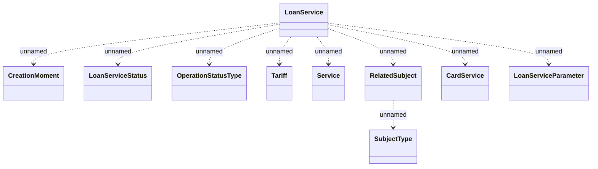

# Loan Services

- **Diagram Type**: Logical
- **Package**: HomerSelect/BSL/Analysis Model/_Interface/KAFKA messages/Generated KAFKA messages/CSI messages/Loan Services
- **Diagram ID**: 148101
- **Elements**: 11
- **Connectors**: 9

