# CommunicationRecordChangedEvent

- **Diagram Type**: Logical
- **Package**: HomerSelect/BSL/Analysis Model/_Interface/KAFKA messages/Generated KAFKA messages/Communication/v1.0/CommunicationRecordChangedEvent
- **Diagram ID**: 140446
- **Elements**: 12
- **Connectors**: 11

```mermaid
classDiagram
    class CommunicationRecordChangedEventRecordType["CommunicationRecordChangedEventRecordType"]
    class CommunicationRecordChangedEventRecordSubtype["CommunicationRecordChangedEventRecordSubtype"]
    class CommunicationRecordChangedEventRecordResultType["CommunicationRecordChangedEventRecordResultType"]
    class CommunicationRecordChangedEventRecordResultType["CommunicationRecordChangedEventRecordResultType"]
    class CommunicationRecordChangedEventRecordContract["CommunicationRecordChangedEventRecordContract"]
    class CommunicationRecordChangedEventRecordContract["CommunicationRecordChangedEventRecordContract"]
    class CommunicationRecordChangedEventRecordContact["CommunicationRecordChangedEventRecordContact"]
    class CommunicationRecordChangedEventRecordChannel["CommunicationRecordChangedEventRecordChannel"]
    class CommunicationRecordChangedEventRecordUser["CommunicationRecordChangedEventRecordUser"]
    class CommunicationRecordChangedEventRecord["CommunicationRecordChangedEventRecord"]
    class CommunicationRecordChangedEvent["CommunicationRecordChangedEvent"]
    class ADD_Communication_Record_Changed_Event["{ADD}Communication Record Changed Event"]
    CommunicationRecordChangedEventRecord ..> CommunicationRecordChangedEventRecordType : unnamed
    CommunicationRecordChangedEventRecord ..> CommunicationRecordChangedEventRecordSubtype : unnamed
    CommunicationRecordChangedEventRecord ..> CommunicationRecordChangedEventRecordResultType : unnamed
    CommunicationRecordChangedEventRecord ..> CommunicationRecordChangedEventRecordResultType : unnamed
    CommunicationRecordChangedEventRecord ..> CommunicationRecordChangedEventRecordContract : unnamed
    CommunicationRecordChangedEventRecord ..> CommunicationRecordChangedEventRecordContract : unnamed
    CommunicationRecordChangedEventRecord ..> CommunicationRecordChangedEventRecordContact : unnamed
    CommunicationRecordChangedEventRecord ..> CommunicationRecordChangedEventRecordChannel : unnamed
    CommunicationRecordChangedEventRecord ..> CommunicationRecordChangedEventRecordUser : unnamed
    CommunicationRecordChangedEvent ..> CommunicationRecordChangedEventRecord : unnamed
    ADD_Communication_Record_Changed_Event ..> CommunicationRecordChangedEvent : unnamed
```

