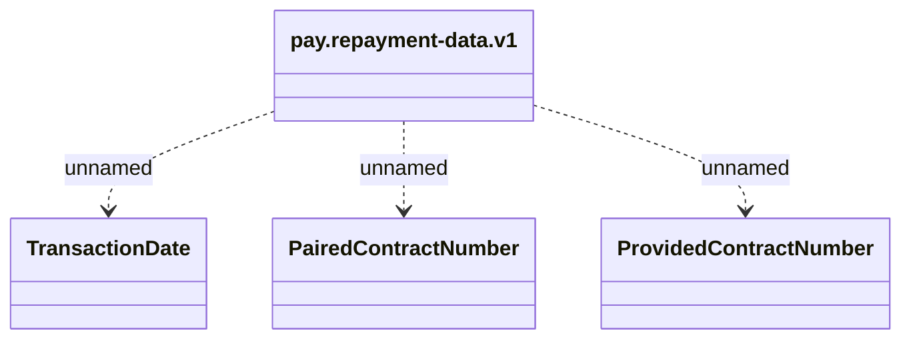

# pay.repayment-data.v1

- **Diagram Type**: Logical
- **Package**: HomerSelect/BSL/Analysis Model/_Interface/KAFKA messages/Generated KAFKA messages/PAYM messages/v1.0/pay.repayment-data.v1
- **Diagram ID**: 141342
- **Elements**: 4
- **Connectors**: 3

