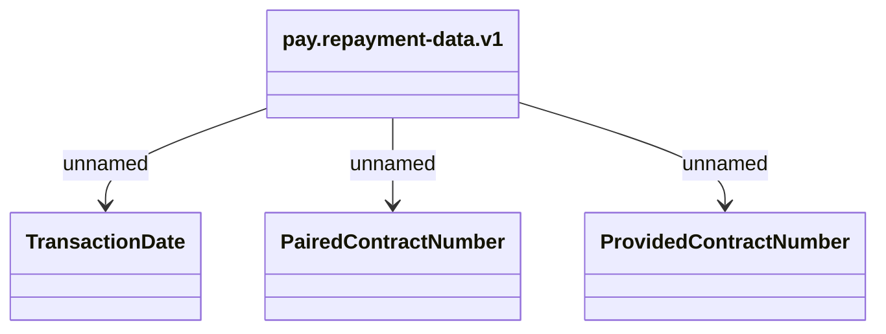

# pay.repayment-data.v1

```mermaid
classDiagram
    class TransactionDate["TransactionDate"]
    class PairedContractNumber["PairedContractNumber"]
    class ProvidedContractNumber["ProvidedContractNumber"]
    class pay_repayment_data_v1["pay.repayment-data.v1"]
    pay_repayment_data_v1 --> TransactionDate : unnamed
    pay_repayment_data_v1 --> PairedContractNumber : unnamed
    pay_repayment_data_v1 --> ProvidedContractNumber : unnamed
```
