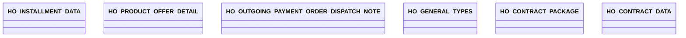

# Reports Common

- **Diagram Type**: Logical
- **Package**: HomerSelect/BSL/Analysis Model/_Interface/Provided Data sources/Logical Data Model/Common
- **Diagram ID**: 151340
- **Elements**: 6
- **Connectors**: 0

