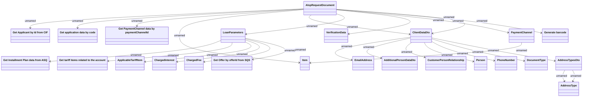

# HO_ALOP_DATA

```mermaid
classDiagram
    class CustomerPersonRelationship["CustomerPersonRelationship"]
    class Get_Installment_Plan_data_from_ASQ["Get Installment Plan data from ASQ"]
    class Get_Applicant_by_Id_from_CIF["Get Applicant by Id from CIF"]
    class AdditionalPersonDataDto["AdditionalPersonDataDto"]
    class Get_application_data_by_code["Get application data by code"]
    class Get_PaymentChannel_data_by_paymentChannelId["Get PaymentChannel data by paymentChannelId"]
    class Get_tariff_items_related_to_the_account["Get tariff items related to the account"]
    class ApplicableTariffItem["ApplicableTariffItem"]
    class Item["Item"]
    class AddressType["AddressType"]
    class Person["Person"]
    class EmailAddress["EmailAddress"]
    class LoanParameters["LoanParameters"]
    class ChargedInterest["ChargedInterest"]
    class PhoneNumber["PhoneNumber"]
    class ChargedFee["ChargedFee"]
    class VerificationData["VerificationData"]
    class PaymentChannel["PaymentChannel"]
    class DocumentType["DocumentType"]
    class Get_Offer_by_offerId_from_SQS["Get Offer by offerId from SQS"]
    class Generate_barcode["Generate barcode"]
    class AddressTypesDto["AddressTypesDto"]
    class ClientDataDto["ClientDataDto"]
    class AlopRequestDocument["AlopRequestDocument"]
    ClientDataDto --> EmailAddress : unnamed
    LoanParameters --> Get_Installment_Plan_data_from_ASQ : unnamed
    AlopRequestDocument --> Get_Applicant_by_Id_from_CIF : unnamed
    ClientDataDto --> AdditionalPersonDataDto : unnamed
    AlopRequestDocument --> Get_application_data_by_code : unnamed
    AlopRequestDocument --> Get_PaymentChannel_data_by_paymentChannelId : unnamed
    LoanParameters --> Get_tariff_items_related_to_the_account : unnamed
    LoanParameters --> ApplicableTariffItem : unnamed
    AlopRequestDocument --> Item : unnamed
    PaymentChannel --> Item : unnamed
    AddressTypesDto --> AddressType : unnamed
    ClientDataDto --> CustomerPersonRelationship : unnamed
    ClientDataDto --> Person : unnamed
    AlopRequestDocument --> ClientDataDto : unnamed
    AlopRequestDocument --> LoanParameters : unnamed
    LoanParameters --> ChargedInterest : unnamed
    ClientDataDto --> PhoneNumber : unnamed
    LoanParameters --> ChargedFee : unnamed
    AlopRequestDocument --> VerificationData : unnamed
    AlopRequestDocument --> PaymentChannel : unnamed
    ClientDataDto --> DocumentType : unnamed
    LoanParameters --> Get_Offer_by_offerId_from_SQS : unnamed
    AlopRequestDocument --> Generate_barcode : unnamed
    ClientDataDto --> AddressTypesDto : unnamed
    AlopRequestDocument --> ClientDataDto : unnamed
    AddressTypesDto --> AddressType : unnamed
```
