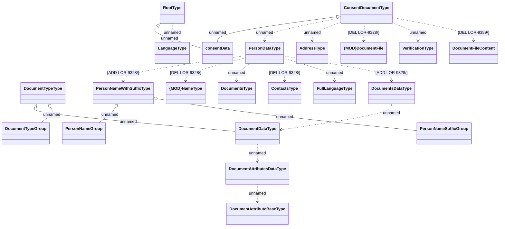

# HO_CONSENT_DATA

- **Diagram Type**: Logical
- **Package**: HomerSelect/BSL/Analysis Model/_Interface/Provided Data sources/Logical Data Model/Common/HO_CONSENT_DATA
- **Diagram ID**: 158051
- **Elements**: 22
- **Connectors**: 21

