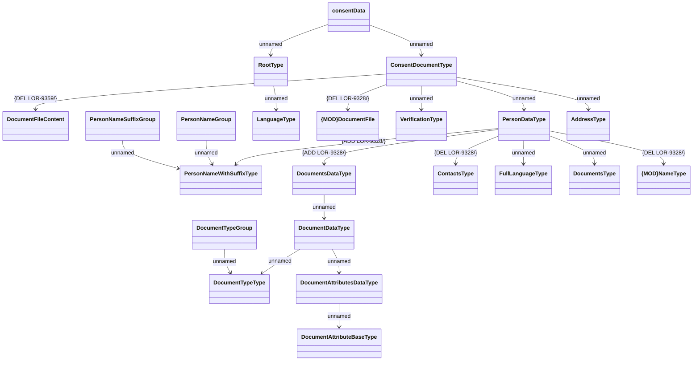

# HO_CONSENT_DATA

```mermaid
classDiagram
    class DocumentFileContent["DocumentFileContent"]
    class DocumentTypeType["DocumentTypeType"]
    class DocumentTypeGroup["DocumentTypeGroup"]
    class DocumentAttributeBaseType["DocumentAttributeBaseType"]
    class PersonNameWithSuffixType["PersonNameWithSuffixType"]
    class PersonNameSuffixGroup["PersonNameSuffixGroup"]
    class PersonNameGroup["PersonNameGroup"]
    class DocumentAttributesDataType["DocumentAttributesDataType"]
    class DocumentDataType["DocumentDataType"]
    class DocumentsDataType["DocumentsDataType"]
    class LanguageType["LanguageType"]
    class RootType["RootType"]
    class ContactsType["ContactsType"]
    class MOD_DocumentFile["{MOD}DocumentFile"]
    class VerificationType["VerificationType"]
    class FullLanguageType["FullLanguageType"]
    class consentData["consentData"]
    class DocumentsType["DocumentsType"]
    class PersonDataType["PersonDataType"]
    class AddressType["AddressType"]
    class MOD_NameType["{MOD}NameType"]
    class ConsentDocumentType["ConsentDocumentType"]
    PersonDataType --> PersonNameWithSuffixType : {ADD LOR-9328/}
    DocumentAttributesDataType --> DocumentAttributeBaseType : unnamed
    DocumentDataType --> DocumentTypeType : unnamed
    DocumentDataType --> DocumentAttributesDataType : unnamed
    DocumentsDataType --> DocumentDataType : unnamed
    consentData --> ConsentDocumentType : unnamed
    ConsentDocumentType --> PersonDataType : unnamed
    PersonDataType --> MOD_NameType : {DEL LOR-9328/}
    PersonDataType --> DocumentsType : unnamed
    PersonDataType --> ContactsType : {DEL LOR-9328/}
    PersonDataType --> FullLanguageType : unnamed
    PersonDataType --> DocumentsDataType : {ADD LOR-9328/}
    ConsentDocumentType --> AddressType : unnamed
    ConsentDocumentType --> MOD_DocumentFile : {DEL LOR-9328/}
    ConsentDocumentType --> VerificationType : unnamed
    ConsentDocumentType --> DocumentFileContent : {DEL LOR-9359/}
    consentData --> RootType : unnamed
    RootType --> LanguageType : unnamed
    DocumentTypeGroup --> DocumentTypeType : unnamed
    PersonNameGroup --> PersonNameWithSuffixType : unnamed
    PersonNameSuffixGroup --> PersonNameWithSuffixType : unnamed
```
