# HO_CONTRACT_DATA - client data

- **Diagram Type**: Logical
- **Package**: HomerSelect/BSL/Analysis Model/_Interface/Provided Data sources/Logical Data Model/Common/HO_CONTRACT_DATA
- **Diagram ID**: 158418
- **Elements**: 52
- **Connectors**: 63

```mermaid
classDiagram
    class ADD_externalCustomerDataList["{ADD}externalCustomerDataList"]
    class PersonFullNameBaseType["PersonFullNameBaseType"]
    class PersonNameSuffixGroup["PersonNameSuffixGroup"]
    class AdditionalNameGroup["AdditionalNameGroup"]
    class PersonNameGroup["PersonNameGroup"]
    class PersonFullNameType["PersonFullNameType"]
    class DocumentAttributesType["DocumentAttributesType"]
    class DocumentAttributeBaseType["DocumentAttributeBaseType"]
    class DocumentFileContent["DocumentFileContent"]
    class DocumentTypeGroup["DocumentTypeGroup"]
    class DocumentWithBarCodePrefixType["DocumentWithBarCodePrefixType"]
    class DocumentsType["DocumentsType"]
    class ExternalPaymentCard["ExternalPaymentCard"]
    class PaymentProvider["PaymentProvider"]
    class DirectDebitMandate["DirectDebitMandate"]
    class DirectDebitMandates["DirectDebitMandates"]
    class NameBaseType["NameBaseType"]
    class LanguagesType["LanguagesType"]
    class MOD_EmploymentType["{MOD}EmploymentType"]
    class LanguageType["LanguageType"]
    class RootType["RootType"]
    class BankAccount["BankAccount"]
    class PaymentChannel["PaymentChannel"]
    class PaymentChannelsType["PaymentChannelsType"]
    class ContractFinancialAmounts["ContractFinancialAmounts"]
    class MOD_DocumentFile["{MOD}DocumentFile"]
    class FinancialSituationType["FinancialSituationType"]
    class MOD_DocumentType["{MOD}DocumentType"]
    class MOD_DocumentAttributeType["{MOD}DocumentAttributeType"]
    class MOD_FinancialDataRemittance["{MOD}FinancialDataRemittance"]
    class MOD_AdditionalPersonType["{MOD}AdditionalPersonType"]
    class PersonCustomDataType["PersonCustomDataType"]
    class MOD_NameType["{MOD}NameType"]
    class EmploymentContactType["EmploymentContactType"]
    class AddressType["AddressType"]
    class ContactType["ContactType"]
    class ContactsType["ContactsType"]
    class MOD_PersonalDetailsType["{MOD}PersonalDetailsType"]
    class AdditionalPersonTypeList["AdditionalPersonTypeList"]
    class AddressesType["AddressesType"]
    class ClientPossetionType["ClientPossetionType"]
    class ClientPossetionTypeList["ClientPossetionTypeList"]
    class MOD_RefinancedContractType["{MOD}RefinancedContractType"]
    class FullLanguageType["FullLanguageType"]
    class CommodityType["CommodityType"]
    class SecurityQuestionType["SecurityQuestionType"]
    class RefinancingDataType["RefinancingDataType"]
    class OtherInformationType["OtherInformationType"]
    class MOD_FinancialType["{MOD}FinancialType"]
    class CommoditiesType["CommoditiesType"]
    class contractData["contractData"]
    class MOD_DocumentData["{MOD}DocumentData"]
    PaymentChannel ..> ExternalPaymentCard : unnamed
    MOD_DocumentData ..> MOD_DocumentFile : {DEL LOR-9359/}
    MOD_RefinancedContractType ..> ContractFinancialAmounts : unnamed
    MOD_DocumentData ..> PaymentChannelsType : unnamed
    PaymentChannelsType ..> PaymentChannel : unnamed
    DirectDebitMandate ..> BankAccount : unnamed
    PaymentChannel ..> BankAccount : unnamed
    RootType <|-- contractData : unnamed
    MOD_DocumentData ..> MOD_EmploymentType : unnamed
    MOD_DocumentData ..> LanguagesType : unnamed
    MOD_AdditionalPersonType ..> NameBaseType : unnamed
    MOD_DocumentData ..> DirectDebitMandates : unnamed
    MOD_DocumentData --> ADD_externalCustomerDataList : unnamed
    MOD_AdditionalPersonType ..> PersonFullNameBaseType : unnamed
    DirectDebitMandates ..> DirectDebitMandate : unnamed
    PaymentChannel ..> PaymentProvider : unnamed
    DocumentsType ..> DocumentWithBarCodePrefixType : unnamed
    MOD_AdditionalPersonType ..> DocumentsType : unnamed
    MOD_PersonalDetailsType ..> DocumentsType : unnamed
    MOD_PersonalDetailsType ..> PersonFullNameType : unnamed
    MOD_DocumentData ..> AdditionalPersonTypeList : unnamed
    MOD_AdditionalPersonType ..> AddressesType : unnamed
    MOD_DocumentData ..> AddressesType : unnamed
    ClientPossetionTypeList ..> ClientPossetionType : unnamed
    MOD_DocumentData ..> MOD_PersonalDetailsType : unnamed
    RefinancingDataType ..> MOD_RefinancedContractType : unnamed
    MOD_DocumentData ..> ContactsType : unnamed
    CommoditiesType ..> CommodityType : unnamed
    MOD_DocumentData ..> SecurityQuestionType : unnamed
    MOD_DocumentData ..> RefinancingDataType : unnamed
    MOD_DocumentData ..> OtherInformationType : unnamed
    MOD_DocumentData ..> MOD_FinancialType : unnamed
    MOD_DocumentData ..> CommoditiesType : unnamed
    MOD_FinancialType ..> ClientPossetionTypeList : unnamed
    MOD_PersonalDetailsType ..> MOD_NameType : unnamed
    MOD_DocumentData <|-- contractData : unnamed
    MOD_AdditionalPersonType ..> MOD_FinancialDataRemittance : unnamed
    AdditionalPersonTypeList ..> MOD_AdditionalPersonType : unnamed
    ADD_externalCustomerDataList --> AdditionalPersonTypeList : unnamed
    MOD_AdditionalPersonType ..> PersonCustomDataType : unnamed
    MOD_PersonalDetailsType ..> FinancialSituationType : unnamed
    MOD_EmploymentType ..> EmploymentContactType : unnamed
    MOD_EmploymentType ..> AddressType : unnamed
    ContactType <|-- EmploymentContactType : unnamed
    MOD_AdditionalPersonType ..> ContactType : unnamed
    MOD_PersonalDetailsType ..> PersonCustomDataType : unnamed
    RootType ..> LanguageType : unnamed
    PersonFullNameBaseType o-- AdditionalNameGroup : unnamed
    PersonFullNameType o-- AdditionalNameGroup : unnamed
    PersonFullNameBaseType o-- PersonNameGroup : unnamed
    PersonFullNameType o-- PersonNameGroup : unnamed
    AddressesType ..> AddressType : unnamed
    MOD_DocumentType o-- DocumentTypeGroup : unnamed
    MOD_DocumentType ..> DocumentAttributesType : unnamed
    MOD_DocumentType <|-- DocumentWithBarCodePrefixType : unnamed
    MOD_DocumentType ..> MOD_DocumentFile : unnamed
    PersonFullNameType o-- PersonNameSuffixGroup : unnamed
    DocumentFileContent <|-- MOD_DocumentFile : unnamed
    NameBaseType <|-- MOD_NameType : unnamed
    DocumentAttributeBaseType <|-- MOD_DocumentAttributeType : unnamed
    DocumentAttributesType ..> MOD_DocumentAttributeType : unnamed
    LanguagesType ..> FullLanguageType : unnamed
    ContactsType ..> ContactType : unnamed
```

