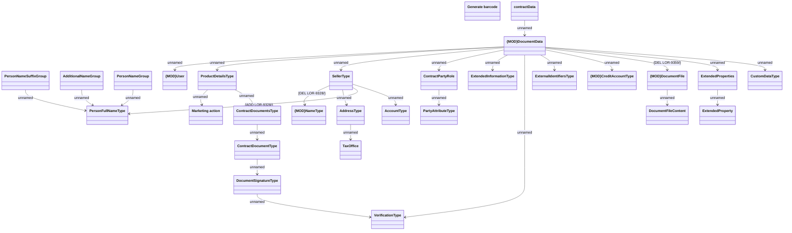

# HO_CONTRACT_DATA - contract data

```mermaid
classDiagram
    class Generate_barcode["Generate barcode"]
    class PersonNameSuffixGroup["PersonNameSuffixGroup"]
    class AdditionalNameGroup["AdditionalNameGroup"]
    class PersonNameGroup["PersonNameGroup"]
    class PersonFullNameType["PersonFullNameType"]
    class DocumentFileContent["DocumentFileContent"]
    class AccountType["AccountType"]
    class ExtendedProperties["ExtendedProperties"]
    class ExtendedProperty["ExtendedProperty"]
    class MOD_DocumentFile["{MOD}DocumentFile"]
    class DocumentSignatureType["DocumentSignatureType"]
    class MOD_CreditAccountType["{MOD}CreditAccountType"]
    class ExternalIdentifiersType["ExternalIdentifiersType"]
    class MOD_User["{MOD}User"]
    class PartyAttributeType["PartyAttributeType"]
    class CustomDataType["CustomDataType"]
    class VerificationType["VerificationType"]
    class TaxOffice["TaxOffice"]
    class ExtendedInformationType["ExtendedInformationType"]
    class ContractPartyRole["ContractPartyRole"]
    class ContractDocumentsType["ContractDocumentsType"]
    class AddressType["AddressType"]
    class Marketing_action["Marketing action"]
    class SellerType["SellerType"]
    class ContractDocumentType["ContractDocumentType"]
    class ProductDetailsType["ProductDetailsType"]
    class MOD_NameType["{MOD}NameType"]
    class MOD_DocumentData["{MOD}DocumentData"]
    class contractData["contractData"]
    MOD_DocumentData --> CustomDataType : unnamed
    SellerType --> AccountType : unnamed
    MOD_DocumentData --> ExtendedProperties : unnamed
    MOD_DocumentData --> MOD_DocumentFile : {DEL LOR-9359/}
    ContractDocumentType --> DocumentSignatureType : unnamed
    MOD_DocumentData --> MOD_CreditAccountType : unnamed
    MOD_DocumentData --> ExternalIdentifiersType : unnamed
    SellerType --> PersonFullNameType : {ADD LOR-9328/}
    ContractPartyRole --> PartyAttributeType : unnamed
    contractData --> MOD_DocumentData : unnamed
    MOD_DocumentData --> VerificationType : unnamed
    MOD_DocumentData --> ExtendedInformationType : unnamed
    MOD_DocumentData --> ContractPartyRole : unnamed
    ProductDetailsType --> ContractDocumentsType : unnamed
    SellerType --> AddressType : unnamed
    ProductDetailsType --> Marketing_action : unnamed
    MOD_DocumentData --> SellerType : unnamed
    ContractDocumentsType --> ContractDocumentType : unnamed
    MOD_DocumentData --> ProductDetailsType : unnamed
    SellerType --> MOD_NameType : {DEL LOR-9328/}
    MOD_DocumentData --> MOD_User : unnamed
    AdditionalNameGroup --> PersonFullNameType : unnamed
    PersonNameGroup --> PersonFullNameType : unnamed
    PersonNameSuffixGroup --> PersonFullNameType : unnamed
    MOD_DocumentFile --> DocumentFileContent : unnamed
    DocumentSignatureType --> VerificationType : unnamed
    ExtendedProperties --> ExtendedProperty : unnamed
    AddressType --> TaxOffice : unnamed
```
