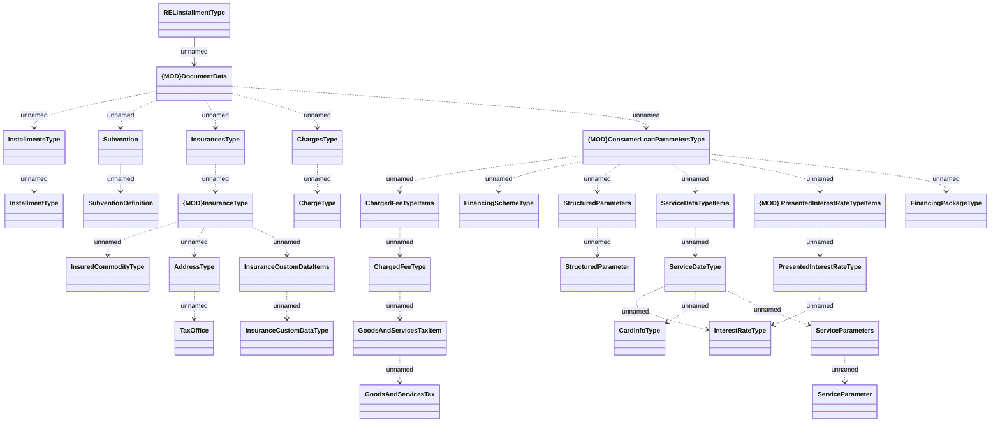

# HO_CONTRACT_DATA - financial data

- **Diagram Type**: Logical
- **Package**: HomerSelect/BSL/Analysis Model/_Interface/Provided Data sources/Logical Data Model/Common/HO_CONTRACT_DATA
- **Diagram ID**: 158419
- **Elements**: 32
- **Connectors**: 32

