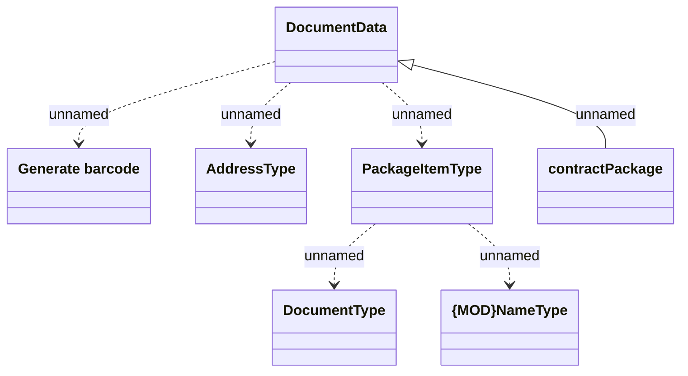

# HO_CONTRACT_PACKAGE

- **Diagram Type**: Logical
- **Package**: HomerSelect/BSL/Analysis Model/_Interface/Provided Data sources/Logical Data Model/Common/HO_CONTRACT_PACKAGE
- **Diagram ID**: 111702
- **Elements**: 7
- **Connectors**: 6

