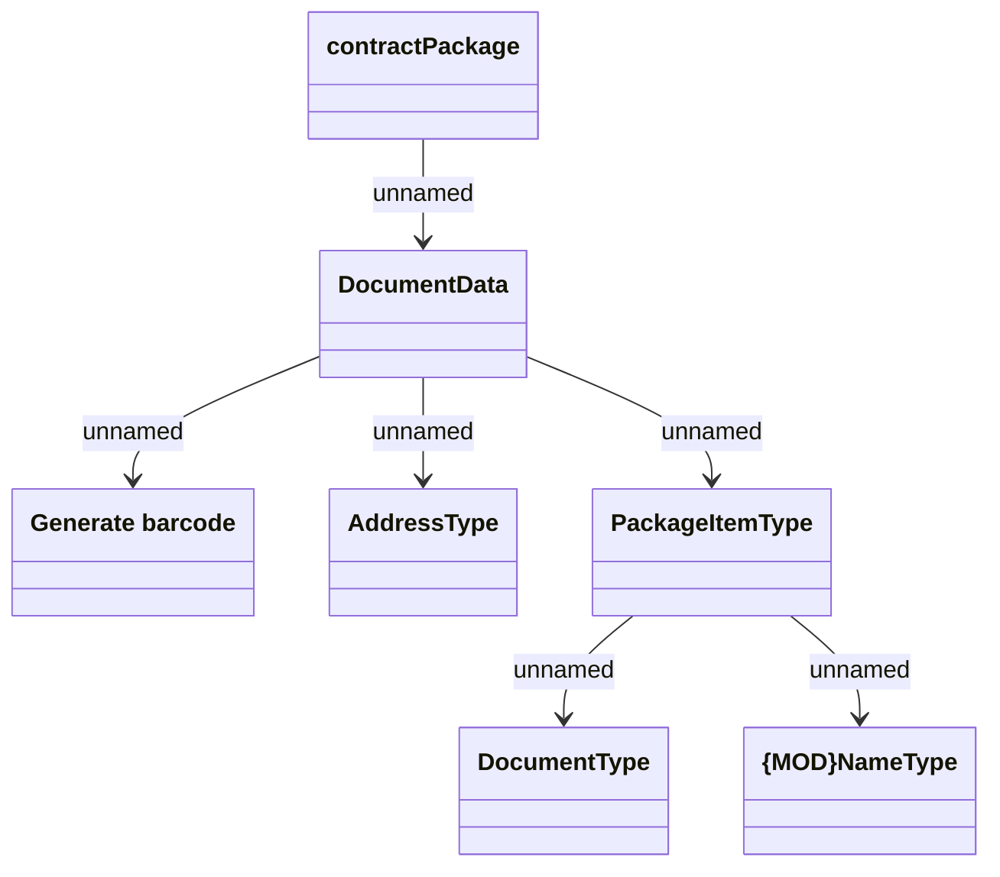

# HO_CONTRACT_PACKAGE

```mermaid
classDiagram
    class MOD_NameType["{MOD}NameType"]
    class Generate_barcode["Generate barcode"]
    class AddressType["AddressType"]
    class DocumentType["DocumentType"]
    class PackageItemType["PackageItemType"]
    class DocumentData["DocumentData"]
    class contractPackage["contractPackage"]
    contractPackage --> DocumentData : unnamed
    DocumentData --> PackageItemType : unnamed
    PackageItemType --> DocumentType : unnamed
    DocumentData --> AddressType : unnamed
    DocumentData --> Generate_barcode : unnamed
    PackageItemType --> MOD_NameType : unnamed
```
