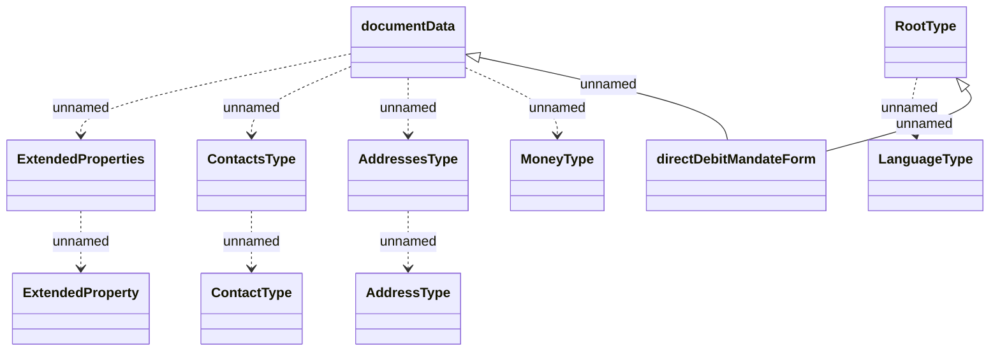

# HO_DIRECT_DEBIT_MANDATE_FORM

- **Diagram Type**: Logical
- **Package**: HomerSelect/BSL/Analysis Model/_Interface/Provided Data sources/Logical Data Model/Common/HO_DIRECT_DEBIT_MANDATE_FORM
- **Diagram ID**: 158394
- **Elements**: 11
- **Connectors**: 10

