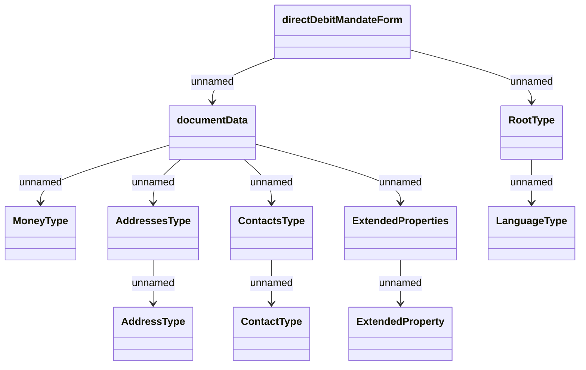

# HO_DIRECT_DEBIT_MANDATE_FORM

```mermaid
classDiagram
    class ExtendedProperties["ExtendedProperties"]
    class ExtendedProperty["ExtendedProperty"]
    class ContactsType["ContactsType"]
    class AddressesType["AddressesType"]
    class ContactType["ContactType"]
    class AddressType["AddressType"]
    class LanguageType["LanguageType"]
    class RootType["RootType"]
    class MoneyType["MoneyType"]
    class documentData["documentData"]
    class directDebitMandateForm["directDebitMandateForm"]
    directDebitMandateForm --> documentData : unnamed
    documentData --> MoneyType : unnamed
    directDebitMandateForm --> RootType : unnamed
    AddressesType --> AddressType : unnamed
    ContactsType --> ContactType : unnamed
    documentData --> AddressesType : unnamed
    documentData --> ContactsType : unnamed
    documentData --> ExtendedProperties : unnamed
    RootType --> LanguageType : unnamed
    ExtendedProperties --> ExtendedProperty : unnamed
```
