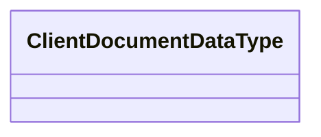

# HO_DOCUMENT_DATA

- **Diagram Type**: Logical
- **Package**: HomerSelect/BSL/Analysis Model/_Interface/Provided Data sources/Logical Data Model/Common/HO_DOCUMENT_DATA
- **Diagram ID**: 81136
- **Elements**: 1
- **Connectors**: 0

