# HO_GENERAL_TYPES

- **Diagram Type**: Logical
- **Package**: HomerSelect/BSL/Analysis Model/_Interface/Provided Data sources/Logical Data Model/Common/HO_GENERAL_TYPES
- **Diagram ID**: 164359
- **Elements**: 62
- **Connectors**: 50

```mermaid
classDiagram
    class DocumentAttributeBaseType["DocumentAttributeBaseType"]
    class DocumentFileContent["DocumentFileContent"]
    class DocumentTypeType["DocumentTypeType"]
    class DocumentTypeGroup["DocumentTypeGroup"]
    class PersonNameWithSuffixType["PersonNameWithSuffixType"]
    class PersonFullNameType["PersonFullNameType"]
    class PersonFullNameBaseType["PersonFullNameBaseType"]
    class PersonNameSuffixGroup["PersonNameSuffixGroup"]
    class AdditionalNameGroup["AdditionalNameGroup"]
    class PersonNameGroup["PersonNameGroup"]
    class DocumentWithBarCodePrefixType["DocumentWithBarCodePrefixType"]
    class ExtendedProperties["ExtendedProperties"]
    class ExtendedProperty["ExtendedProperty"]
    class NameBaseType["NameBaseType"]
    class PaymentChannelComplexType["PaymentChannelComplexType"]
    class BankAccountType["BankAccountType"]
    class FinancingPackageType["FinancingPackageType"]
    class PaymentChannelsType["PaymentChannelsType"]
    class FinancingSchemeType["FinancingSchemeType"]
    class ChargeType["ChargeType"]
    class ServiceParameters["ServiceParameters"]
    class ServiceParameter["ServiceParameter"]
    class ChargesType["ChargesType"]
    class CardInfoType["CardInfoType"]
    class GoodsAndServicesTaxItem["GoodsAndServicesTaxItem"]
    class GoodsAndServicesTax["GoodsAndServicesTax"]
    class ServiceDataTypeItems["ServiceDataTypeItems"]
    class ChargedFeeTypeItems["ChargedFeeTypeItems"]
    class ChargedFeeType["ChargedFeeType"]
    class PaymentOnPosSettlementsDto["PaymentOnPosSettlementsDto"]
    class PaymentOnPosSettlementDto["PaymentOnPosSettlementDto"]
    class ServiceDateType["ServiceDateType"]
    class MOD_ConsumerLoanParametersType["{MOD}ConsumerLoanParametersType"]
    class ServiceDetailType["ServiceDetailType"]
    class MOD_PresentedInterestRateTypeItems["{MOD} PresentedInterestRateTypeItems"]
    class PaymentType["PaymentType"]
    class PaymentsType["PaymentsType"]
    class LanguagesType["LanguagesType"]
    class DocumentAttributesType["DocumentAttributesType"]
    class TaxOffice["TaxOffice"]
    class ProductOfferFeesAndServices["ProductOfferFeesAndServices"]
    class PresentedInterestRateType["PresentedInterestRateType"]
    class InterestRateType["InterestRateType"]
    class InstallmentType["InstallmentType"]
    class ContactsType["ContactsType"]
    class AddressesType["AddressesType"]
    class DocumentSignatureType["DocumentSignatureType"]
    class VerificationType["VerificationType"]
    class DocumentsType["DocumentsType"]
    class MOD_DocumentFile["{MOD}DocumentFile"]
    class MOD_KeyAndValueType["{MOD}KeyAndValueType"]
    class ClientDocumentDataType["ClientDocumentDataType"]
    class ContactType["ContactType"]
    class AddressType["AddressType"]
    class MOD_DocumentAttributeType["{MOD}DocumentAttributeType"]
    class MOD_DocumentType["{MOD}DocumentType"]
    class FullLanguageType["FullLanguageType"]
    class MOD_NameType["{MOD}NameType"]
    class MoneyType["MoneyType"]
    class LanguageType["LanguageType"]
    class RootType["RootType"]
    class ProductOfferDetailType["ProductOfferDetailType"]
    AddressType ..> TaxOffice : unnamed
    MOD_ConsumerLoanParametersType ..> ChargedFeeTypeItems : unnamed
    ChargedFeeTypeItems ..> ChargedFeeType : unnamed
    PaymentOnPosSettlementsDto ..> PaymentOnPosSettlementDto : unnamed
    ServiceDataTypeItems ..> ServiceDateType : unnamed
    ProductOfferDetailType ..> ServiceDetailType : unnamed
    MOD_ConsumerLoanParametersType ..> MOD_PresentedInterestRateTypeItems : unnamed
    ProductOfferDetailType ..> MOD_PresentedInterestRateTypeItems : unnamed
    PaymentsType ..> PaymentType : unnamed
    DocumentAttributesType ..> MOD_DocumentAttributeType : unnamed
    MOD_DocumentType ..> DocumentAttributesType : unnamed
    ChargedFeeType ..> GoodsAndServicesTaxItem : unnamed
    ProductOfferDetailType ..> ProductOfferFeesAndServices : unnamed
    MOD_PresentedInterestRateTypeItems ..> PresentedInterestRateType : unnamed
    ServiceDateType ..> InterestRateType : unnamed
    PresentedInterestRateType ..> InterestRateType : unnamed
    ProductOfferDetailType ..> InstallmentType : unnamed
    DocumentSignatureType ..> VerificationType : unnamed
    MOD_DocumentType ..> MOD_DocumentFile : unnamed
    ContactsType ..> ContactType : unnamed
    DocumentAttributeBaseType <|-- MOD_DocumentAttributeType : unnamed
    InstallmentType ..> PaymentsType : unnamed
    PaymentChannelsType ..> PaymentChannelComplexType : unnamed
    DocumentFileContent <|-- MOD_DocumentFile : unnamed
    DocumentTypeType o-- DocumentTypeGroup : unnamed
    PersonNameWithSuffixType o-- PersonNameGroup : unnamed
    PersonNameWithSuffixType o-- PersonNameSuffixGroup : unnamed
    PersonFullNameType o-- AdditionalNameGroup : unnamed
    PersonFullNameType o-- PersonNameGroup : unnamed
    PersonFullNameType o-- PersonNameSuffixGroup : unnamed
    PersonFullNameBaseType o-- PersonNameGroup : unnamed
    PersonFullNameBaseType o-- AdditionalNameGroup : unnamed
    MOD_ConsumerLoanParametersType ..> ServiceDataTypeItems : unnamed
    NameBaseType <|-- MOD_NameType : unnamed
    GoodsAndServicesTaxItem ..> GoodsAndServicesTax : unnamed
    PaymentChannelComplexType ..> BankAccountType : unnamed
    MOD_ConsumerLoanParametersType ..> FinancingPackageType : unnamed
    MOD_ConsumerLoanParametersType ..> FinancingSchemeType : unnamed
    ChargesType ..> ChargeType : unnamed
    ServiceDateType ..> ServiceParameters : unnamed
    ServiceParameters ..> ServiceParameter : unnamed
    ServiceDateType ..> ChargesType : unnamed
    ServiceDateType ..> CardInfoType : unnamed
    MOD_DocumentType o-- DocumentTypeGroup : unnamed
    ExtendedProperties ..> ExtendedProperty : unnamed
    AddressesType ..> AddressType : unnamed
    MOD_DocumentType <|-- DocumentWithBarCodePrefixType : unnamed
    DocumentsType ..> MOD_DocumentType : unnamed
    LanguagesType ..> FullLanguageType : unnamed
    RootType ..> LanguageType : unnamed
```

