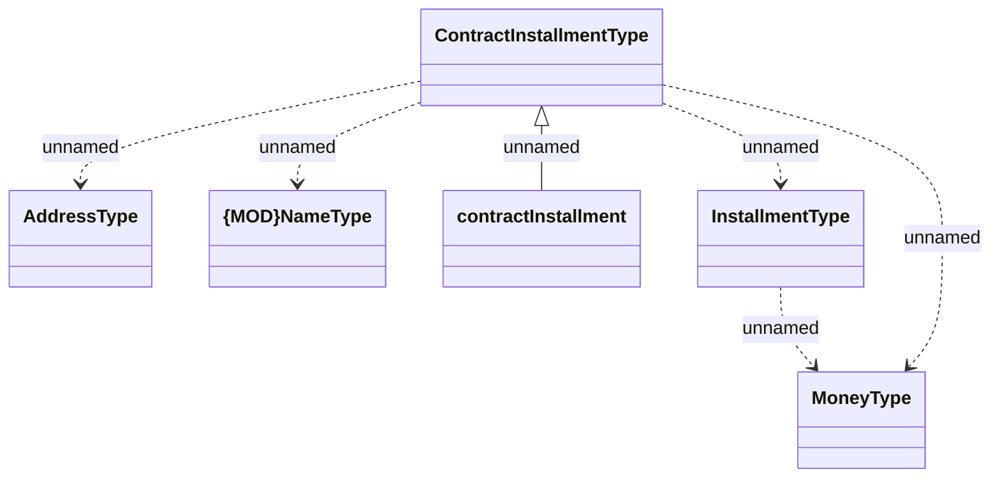

# HO_INSTALLMENT_DATA

- **Diagram Type**: Logical
- **Package**: HomerSelect/BSL/Analysis Model/_Interface/Provided Data sources/Logical Data Model/Common/HO_INSTALLMENT_DATA
- **Diagram ID**: 139140
- **Elements**: 6
- **Connectors**: 6

