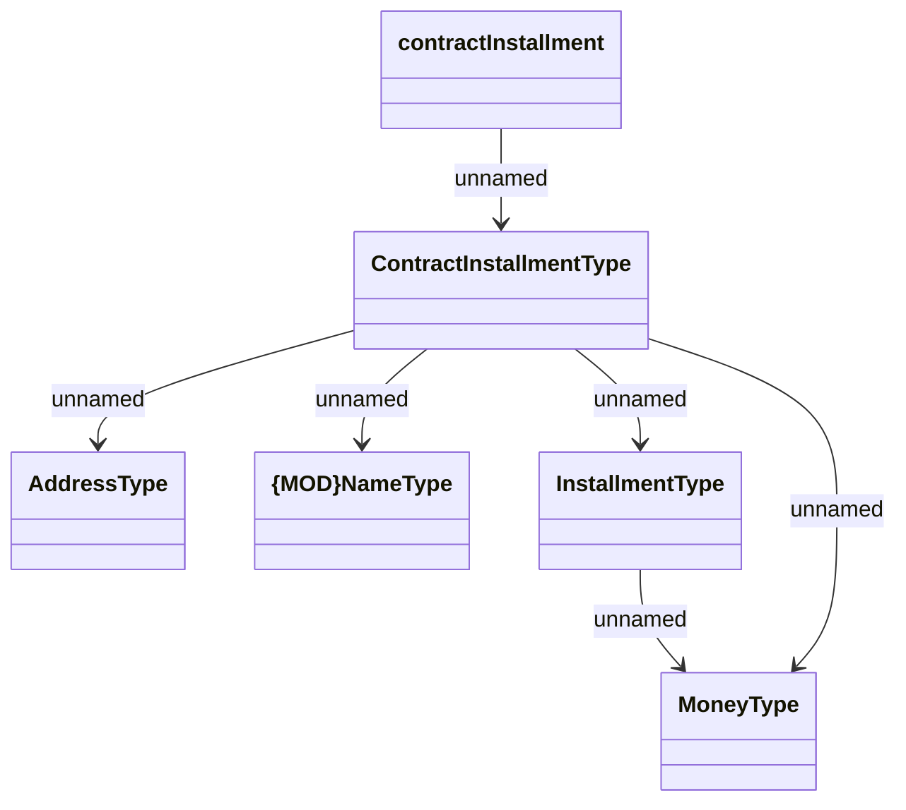

# HO_INSTALLMENT_DATA

```mermaid
classDiagram
    class AddressType["AddressType"]
    class MOD_NameType["{MOD}NameType"]
    class contractInstallment["contractInstallment"]
    class MoneyType["MoneyType"]
    class InstallmentType["InstallmentType"]
    class ContractInstallmentType["ContractInstallmentType"]
    contractInstallment --> ContractInstallmentType : unnamed
    ContractInstallmentType --> InstallmentType : unnamed
    InstallmentType --> MoneyType : unnamed
    ContractInstallmentType --> MoneyType : unnamed
    ContractInstallmentType --> MOD_NameType : unnamed
    ContractInstallmentType --> AddressType : unnamed
```
