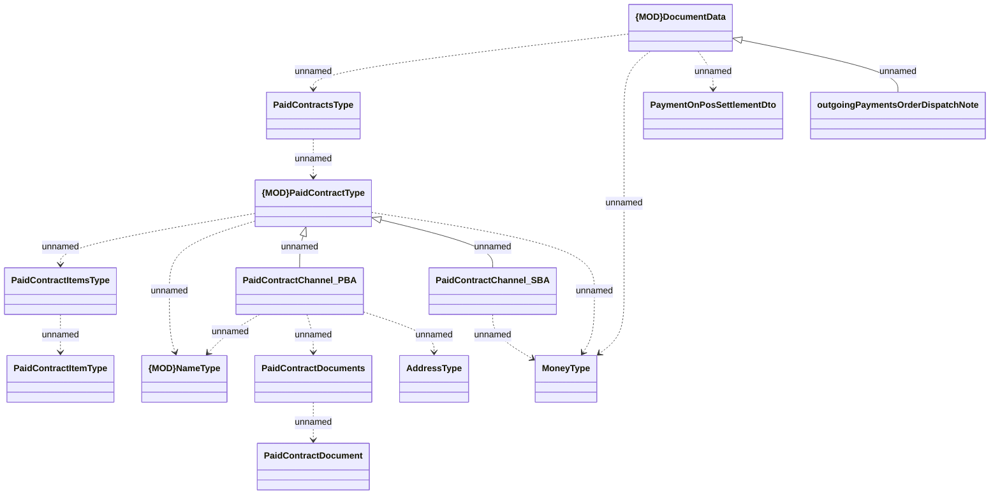

# HO_OUTGOING_PAYMENT_ORDER_DISPATCH_NOTE data source for printout

- **Diagram Type**: Logical
- **Package**: HomerSelect/BSL/Analysis Model/_Interface/Provided Data sources/Logical Data Model/Common/HO_OUTGOING_PAYMENT_ORDER_DISPATCH_NOTE
- **Diagram ID**: 138310
- **Elements**: 14
- **Connectors**: 16

