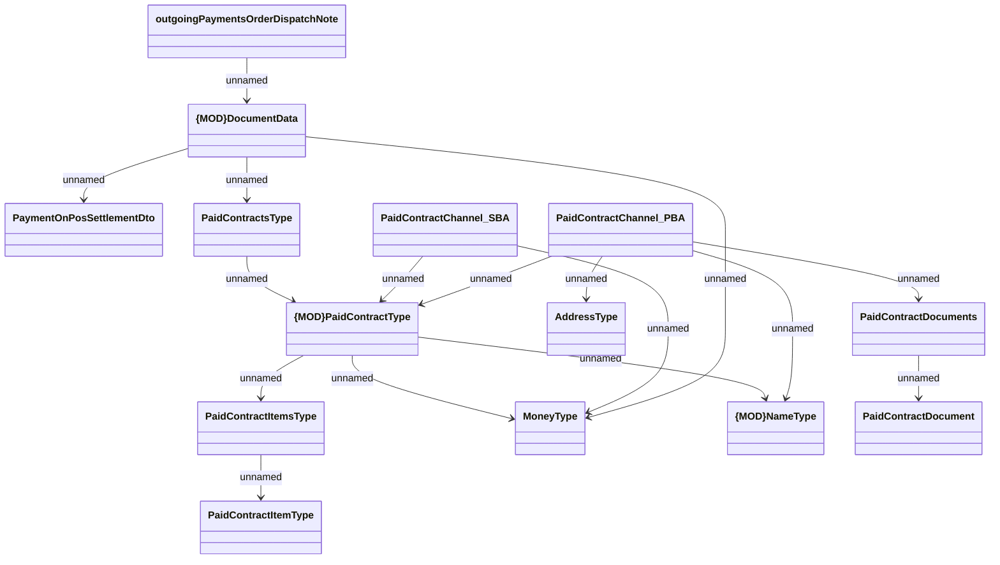

# HO_OUTGOING_PAYMENT_ORDER_DISPATCH_NOTE data source for printout

```mermaid
classDiagram
    class PaymentOnPosSettlementDto["PaymentOnPosSettlementDto"]
    class PaidContractDocuments["PaidContractDocuments"]
    class PaidContractItemsType["PaidContractItemsType"]
    class PaidContractsType["PaidContractsType"]
    class MoneyType["MoneyType"]
    class MOD_NameType["{MOD}NameType"]
    class AddressType["AddressType"]
    class PaidContractDocument["PaidContractDocument"]
    class PaidContractItemType["PaidContractItemType"]
    class MOD_PaidContractType["{MOD}PaidContractType"]
    class MOD_DocumentData["{MOD}DocumentData"]
    class PaidContractChannel_SBA["PaidContractChannel_SBA"]
    class outgoingPaymentsOrderDispatchNote["outgoingPaymentsOrderDispatchNote"]
    class PaidContractChannel_PBA["PaidContractChannel_PBA"]
    PaidContractChannel_PBA --> MOD_NameType : unnamed
    PaidContractChannel_PBA --> PaidContractDocuments : unnamed
    MOD_PaidContractType --> PaidContractItemsType : unnamed
    MOD_DocumentData --> PaidContractsType : unnamed
    MOD_DocumentData --> MoneyType : unnamed
    PaidContractChannel_SBA --> MoneyType : unnamed
    MOD_DocumentData --> PaymentOnPosSettlementDto : unnamed
    MOD_PaidContractType --> MOD_NameType : unnamed
    outgoingPaymentsOrderDispatchNote --> MOD_DocumentData : unnamed
    PaidContractChannel_PBA --> AddressType : unnamed
    PaidContractDocuments --> PaidContractDocument : unnamed
    PaidContractItemsType --> PaidContractItemType : unnamed
    PaidContractChannel_PBA --> MOD_PaidContractType : unnamed
    PaidContractChannel_SBA --> MOD_PaidContractType : unnamed
    PaidContractsType --> MOD_PaidContractType : unnamed
    MOD_PaidContractType --> MoneyType : unnamed
```
