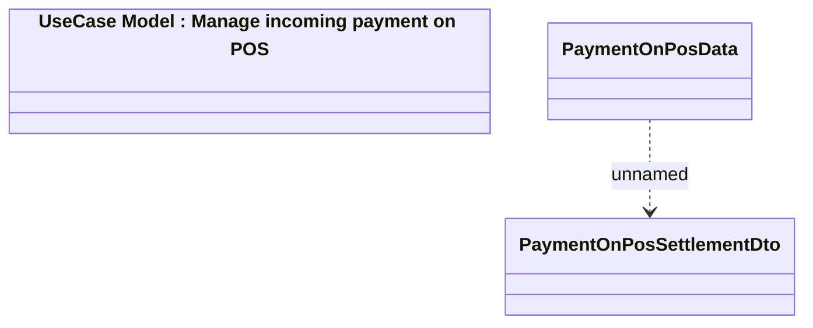

# HO_PAYMENT_ON_POS_DATA data source for print

- **Diagram Type**: Logical
- **Package**: HomerSelect/BSL/Analysis Model/_Interface/Provided Data sources/Logical Data Model/Common/HO_PAYMENT_ON_POS_DATA
- **Diagram ID**: 78326
- **Elements**: 3
- **Connectors**: 1

