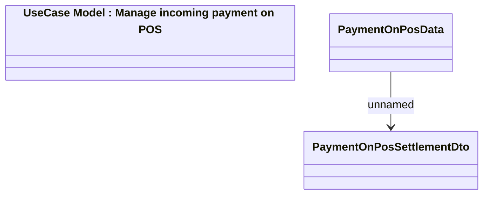

# HO_PAYMENT_ON_POS_DATA data source for print

```mermaid
classDiagram
    class UseCase_Model_Manage_incoming_payment_on_POS["UseCase Model : Manage incoming payment on POS"]
    class PaymentOnPosSettlementDto["PaymentOnPosSettlementDto"]
    class PaymentOnPosData["PaymentOnPosData"]
    PaymentOnPosData --> PaymentOnPosSettlementDto : unnamed
```
