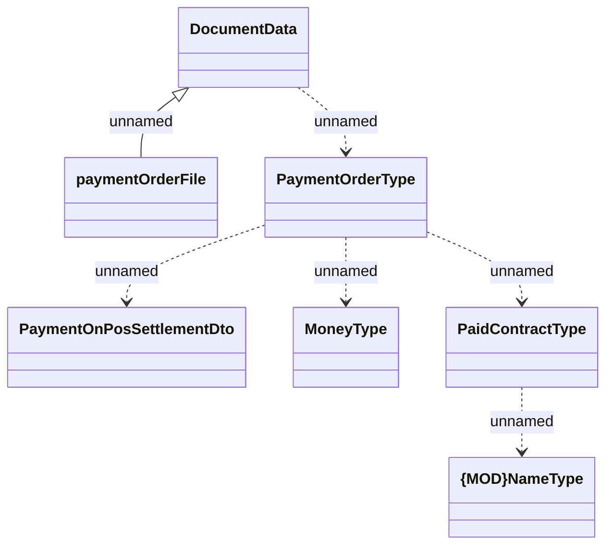

# HO_PAYMENT_ORDER_FILE data source for printout

- **Diagram Type**: Logical
- **Package**: HomerSelect/BSL/Analysis Model/_Interface/Provided Data sources/Logical Data Model/Common/HO_PAYMENT_ORDER_FILE
- **Diagram ID**: 78329
- **Elements**: 7
- **Connectors**: 6

