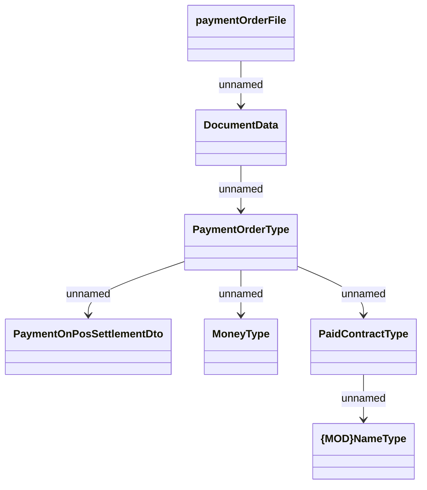

# HO_PAYMENT_ORDER_FILE data source for printout

```mermaid
classDiagram
    class PaymentOnPosSettlementDto["PaymentOnPosSettlementDto"]
    class paymentOrderFile["paymentOrderFile"]
    class MOD_NameType["{MOD}NameType"]
    class MoneyType["MoneyType"]
    class PaidContractType["PaidContractType"]
    class PaymentOrderType["PaymentOrderType"]
    class DocumentData["DocumentData"]
    PaidContractType --> MOD_NameType : unnamed
    PaymentOrderType --> PaidContractType : unnamed
    paymentOrderFile --> DocumentData : unnamed
    DocumentData --> PaymentOrderType : unnamed
    PaymentOrderType --> PaymentOnPosSettlementDto : unnamed
    PaymentOrderType --> MoneyType : unnamed
```
