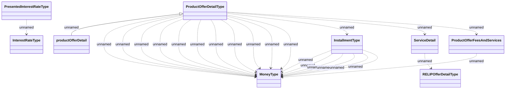

# HO_PRODUCT_OFFER_DETAIL

- **Diagram Type**: Logical
- **Package**: HomerSelect/BSL/Analysis Model/_Interface/Provided Data sources/Logical Data Model/Common/HO_PRODUCT_OFFER_DETAIL
- **Diagram ID**: 149800
- **Elements**: 9
- **Connectors**: 24

