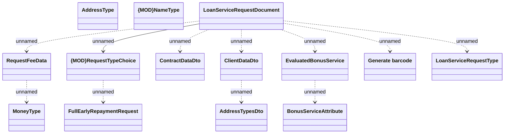

# HO_SERVICE_REQUEST_DATA - FER printout usage

- **Diagram Type**: Logical
- **Package**: HomerSelect/BSL/Analysis Model/_Interface/Provided Data sources/Logical Data Model/Common/HO_SERVICE_REQUEST_DATA
- **Diagram ID**: 136374
- **Elements**: 14
- **Connectors**: 11

