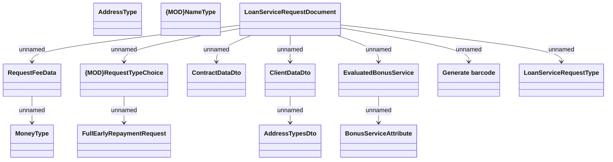

# HO_SERVICE_REQUEST_DATA - FER printout usage

```mermaid
classDiagram
    class ClientDataDto["ClientDataDto"]
    class BonusServiceAttribute["BonusServiceAttribute"]
    class EvaluatedBonusService["EvaluatedBonusService"]
    class FullEarlyRepaymentRequest["FullEarlyRepaymentRequest"]
    class AddressTypesDto["AddressTypesDto"]
    class AddressType["AddressType"]
    class ContractDataDto["ContractDataDto"]
    class MoneyType["MoneyType"]
    class MOD_RequestTypeChoice["{MOD}RequestTypeChoice"]
    class RequestFeeData["RequestFeeData"]
    class Generate_barcode["Generate barcode"]
    class MOD_NameType["{MOD}NameType"]
    class LoanServiceRequestType["LoanServiceRequestType"]
    class LoanServiceRequestDocument["LoanServiceRequestDocument"]
    LoanServiceRequestDocument --> LoanServiceRequestType : unnamed
    LoanServiceRequestDocument --> Generate_barcode : unnamed
    LoanServiceRequestDocument --> RequestFeeData : unnamed
    LoanServiceRequestDocument --> MOD_RequestTypeChoice : unnamed
    RequestFeeData --> MoneyType : unnamed
    LoanServiceRequestDocument --> ClientDataDto : unnamed
    LoanServiceRequestDocument --> ContractDataDto : unnamed
    ClientDataDto --> AddressTypesDto : unnamed
    MOD_RequestTypeChoice --> FullEarlyRepaymentRequest : unnamed
    LoanServiceRequestDocument --> EvaluatedBonusService : unnamed
    EvaluatedBonusService --> BonusServiceAttribute : unnamed
```
