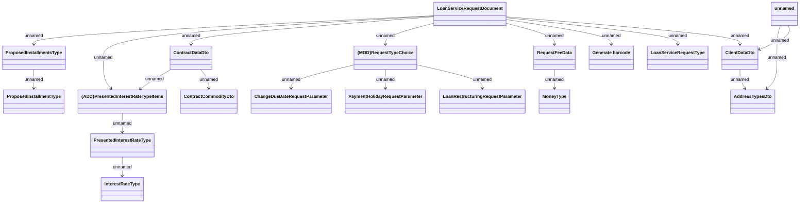

# HO_SERVICE_REQUEST_DATA

```mermaid
classDiagram
    class ClientDataDto["ClientDataDto"]
    class ADD_PresentedInterestRateTypeItems["{ADD}PresentedInterestRateTypeItems"]
    class InterestRateType["InterestRateType"]
    class PresentedInterestRateType["PresentedInterestRateType"]
    class ContractCommodityDto["ContractCommodityDto"]
    class ProposedInstallmentsType["ProposedInstallmentsType"]
    class ProposedInstallmentType["ProposedInstallmentType"]
    class ChangeDueDateRequestParameter["ChangeDueDateRequestParameter"]
    class LoanRestructuringRequestParameter["LoanRestructuringRequestParameter"]
    class AddressTypesDto["AddressTypesDto"]
    class ContractDataDto["ContractDataDto"]
    class PaymentHolidayRequestParameter["PaymentHolidayRequestParameter"]
    class MoneyType["MoneyType"]
    class MOD_RequestTypeChoice["{MOD}RequestTypeChoice"]
    class RequestFeeData["RequestFeeData"]
    class Generate_barcode["Generate barcode"]
    class LoanServiceRequestType["LoanServiceRequestType"]
    class LoanServiceRequestDocument["LoanServiceRequestDocument"]
    ClientDataDto --> AddressTypesDto : unnamed
    ContractDataDto --> ADD_PresentedInterestRateTypeItems : unnamed
    ADD_PresentedInterestRateTypeItems --> PresentedInterestRateType : unnamed
    ContractDataDto --> ContractCommodityDto : unnamed
    LoanServiceRequestDocument --> ProposedInstallmentsType : unnamed
    ProposedInstallmentsType --> ProposedInstallmentType : unnamed
    MOD_RequestTypeChoice --> ChangeDueDateRequestParameter : unnamed
    LoanServiceRequestDocument --> ADD_PresentedInterestRateTypeItems : unnamed
    unnamed --> AddressTypesDto : unnamed
    unnamed --> ClientDataDto : unnamed
    LoanServiceRequestDocument --> ContractDataDto : unnamed
    MOD_RequestTypeChoice --> PaymentHolidayRequestParameter : unnamed
    RequestFeeData --> MoneyType : unnamed
    LoanServiceRequestDocument --> MOD_RequestTypeChoice : unnamed
    LoanServiceRequestDocument --> RequestFeeData : unnamed
    LoanServiceRequestDocument --> Generate_barcode : unnamed
    LoanServiceRequestDocument --> LoanServiceRequestType : unnamed
    LoanServiceRequestDocument --> ClientDataDto : unnamed
    MOD_RequestTypeChoice --> LoanRestructuringRequestParameter : unnamed
    PresentedInterestRateType --> InterestRateType : unnamed
```
