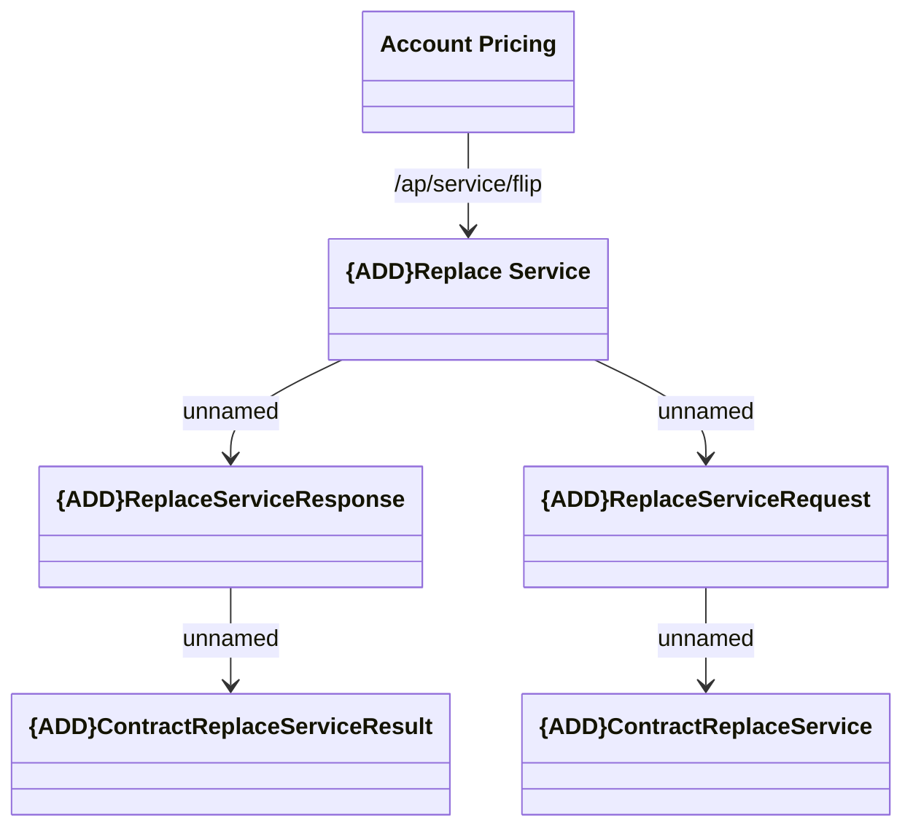

# ReplaceService

- **Diagram Type**: Logical
- **Package**: HomerSelect/BSL/Analysis Model/_Interface/Provided Web Services/Account Pricing
- **Diagram ID**: 127812
- **Elements**: 6
- **Connectors**: 5

