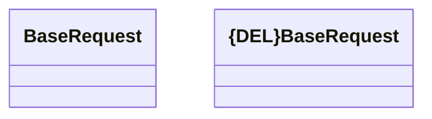

# Common - request

- **Diagram Type**: Logical
- **Package**: HomerSelect/BSL/Analysis Model/_Interface/Provided Web Services/Application Evaluation
- **Diagram ID**: 112076
- **Elements**: 2
- **Connectors**: 0

