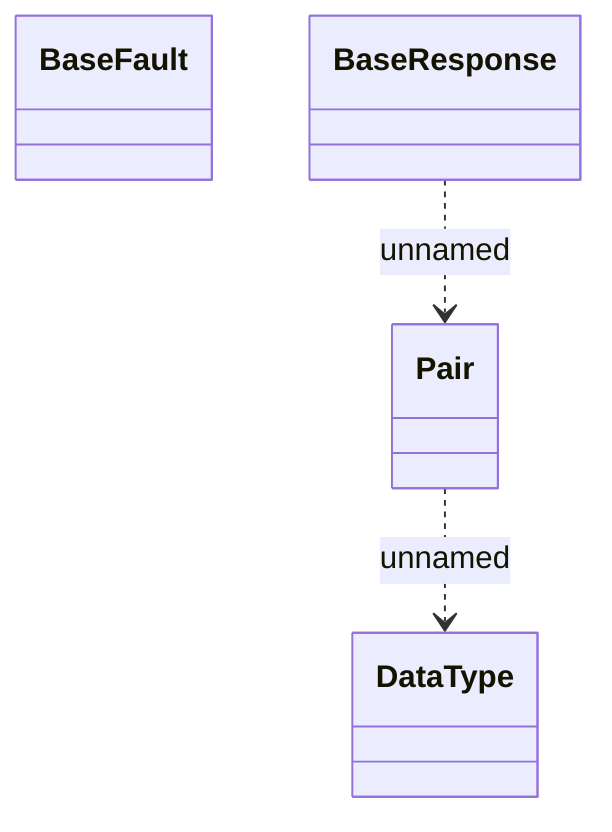

# Common - response

- **Diagram Type**: Logical
- **Package**: HomerSelect/BSL/Analysis Model/_Interface/Provided Web Services/Application Evaluation
- **Diagram ID**: 112077
- **Elements**: 4
- **Connectors**: 2

