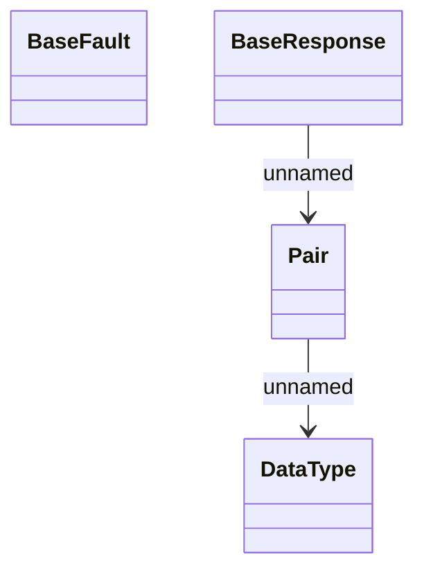

# Common - response

```mermaid
classDiagram
    class BaseFault["BaseFault"]
    class DataType["DataType"]
    class Pair["Pair"]
    class BaseResponse["BaseResponse"]
    BaseResponse --> Pair : unnamed
    Pair --> DataType : unnamed
```
