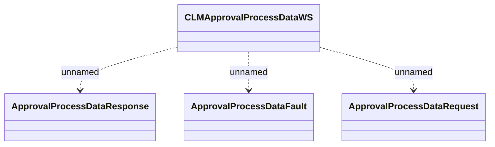

# CLMApprovalProcessData

- **Diagram Type**: Logical
- **Package**: HomerSelect/BSL/Analysis Model/_Interface/Provided Web Services/Application Evaluation/CLMApprovalProcessData
- **Diagram ID**: 96012
- **Elements**: 4
- **Connectors**: 3

