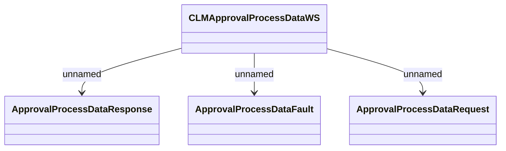

# CLMApprovalProcessData

```mermaid
classDiagram
    class ApprovalProcessDataRequest["ApprovalProcessDataRequest"]
    class ApprovalProcessDataFault["ApprovalProcessDataFault"]
    class ApprovalProcessDataResponse["ApprovalProcessDataResponse"]
    class CLMApprovalProcessDataWS["CLMApprovalProcessDataWS"]
    CLMApprovalProcessDataWS --> ApprovalProcessDataResponse : unnamed
    CLMApprovalProcessDataWS --> ApprovalProcessDataFault : unnamed
    CLMApprovalProcessDataWS --> ApprovalProcessDataRequest : unnamed
```
