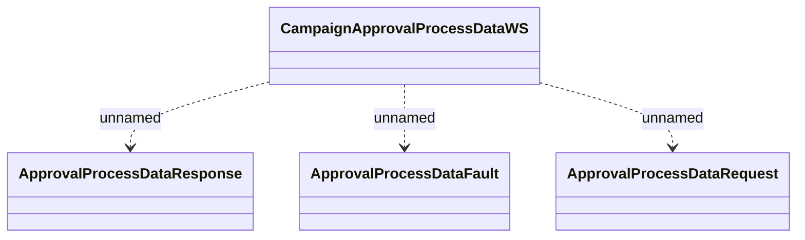

# CampaignApprovalProcessData

- **Diagram Type**: Logical
- **Package**: HomerSelect/BSL/Analysis Model/_Interface/Provided Web Services/Application Evaluation/CampaignApprovalProcessData
- **Diagram ID**: 96011
- **Elements**: 4
- **Connectors**: 3

