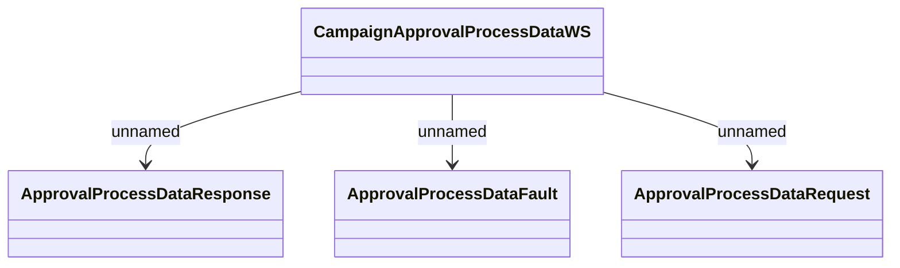

# CampaignApprovalProcessData

```mermaid
classDiagram
    class ApprovalProcessDataRequest["ApprovalProcessDataRequest"]
    class ApprovalProcessDataFault["ApprovalProcessDataFault"]
    class ApprovalProcessDataResponse["ApprovalProcessDataResponse"]
    class CampaignApprovalProcessDataWS["CampaignApprovalProcessDataWS"]
    CampaignApprovalProcessDataWS --> ApprovalProcessDataResponse : unnamed
    CampaignApprovalProcessDataWS --> ApprovalProcessDataFault : unnamed
    CampaignApprovalProcessDataWS --> ApprovalProcessDataRequest : unnamed
```
