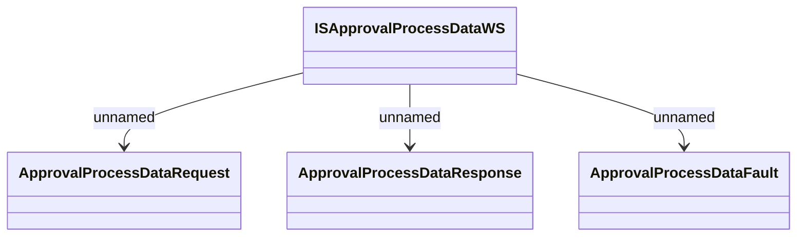

# ISApprovalProcessDataWS

```mermaid
classDiagram
    class ApprovalProcessDataFault["ApprovalProcessDataFault"]
    class ApprovalProcessDataResponse["ApprovalProcessDataResponse"]
    class ApprovalProcessDataRequest["ApprovalProcessDataRequest"]
    class ISApprovalProcessDataWS["ISApprovalProcessDataWS"]
    ISApprovalProcessDataWS --> ApprovalProcessDataRequest : unnamed
    ISApprovalProcessDataWS --> ApprovalProcessDataResponse : unnamed
    ISApprovalProcessDataWS --> ApprovalProcessDataFault : unnamed
```
