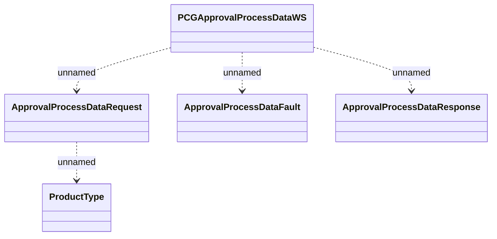

# PCGApprovalProcessData

- **Diagram Type**: Logical
- **Package**: HomerSelect/BSL/Analysis Model/_Interface/Provided Web Services/Application Evaluation/PCGApprovalProcessData
- **Diagram ID**: 96014
- **Elements**: 5
- **Connectors**: 4

