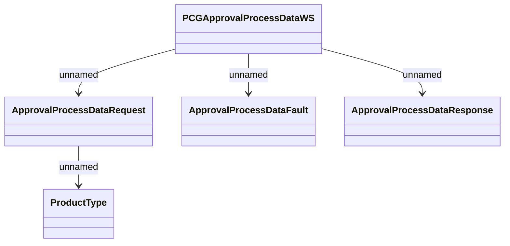

# PCGApprovalProcessData

```mermaid
classDiagram
    class ProductType["ProductType"]
    class ApprovalProcessDataRequest["ApprovalProcessDataRequest"]
    class ApprovalProcessDataFault["ApprovalProcessDataFault"]
    class ApprovalProcessDataResponse["ApprovalProcessDataResponse"]
    class PCGApprovalProcessDataWS["PCGApprovalProcessDataWS"]
    PCGApprovalProcessDataWS --> ApprovalProcessDataResponse : unnamed
    PCGApprovalProcessDataWS --> ApprovalProcessDataFault : unnamed
    PCGApprovalProcessDataWS --> ApprovalProcessDataRequest : unnamed
    ApprovalProcessDataRequest --> ProductType : unnamed
```
