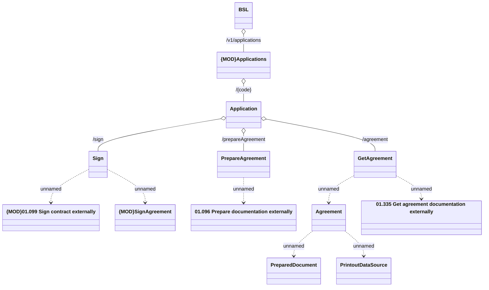

# Agreement

- **Diagram Type**: Logical
- **Package**: HomerSelect/BSL/Analysis Model/_Interface/Provided Web Services/Application/Application Rest/Agreement
- **Diagram ID**: 164346
- **Elements**: 13
- **Connectors**: 12

