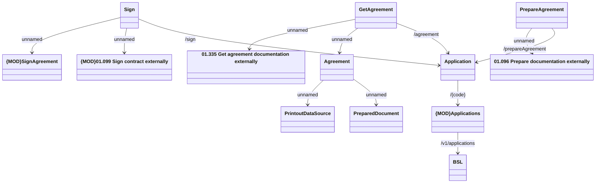

# Agreement

```mermaid
classDiagram
    class MOD_SignAgreement["{MOD}SignAgreement"]
    class MOD_Applications["{MOD}Applications"]
    class n_01_335_Get_agreement_documentation_externally["01.335 Get agreement documentation externally"]
    class Agreement["Agreement"]
    class PrintoutDataSource["PrintoutDataSource"]
    class PreparedDocument["PreparedDocument"]
    class GetAgreement["GetAgreement"]
    class MOD_01_099_Sign_contract_externally["{MOD}01.099 Sign contract externally"]
    class n_01_096_Prepare_documentation_externally["01.096 Prepare documentation externally"]
    class Sign["Sign"]
    class PrepareAgreement["PrepareAgreement"]
    class Application["Application"]
    class BSL["BSL"]
    MOD_Applications --> BSL : /v1/applications
    Sign --> Application : /sign
    PrepareAgreement --> Application : /prepareAgreement
    GetAgreement --> Application : /agreement
    PrepareAgreement --> n_01_096_Prepare_documentation_externally : unnamed
    Sign --> MOD_01_099_Sign_contract_externally : unnamed
    Agreement --> PreparedDocument : unnamed
    Agreement --> PrintoutDataSource : unnamed
    GetAgreement --> Agreement : unnamed
    GetAgreement --> n_01_335_Get_agreement_documentation_externally : unnamed
    Application --> MOD_Applications : /{code}
    Sign --> MOD_SignAgreement : unnamed
```
