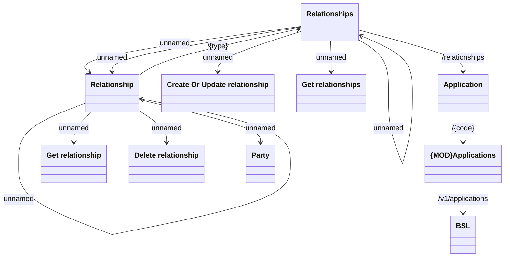

# Application relationship

```mermaid
classDiagram
    class MOD_Applications["{MOD}Applications"]
    class Application["Application"]
    class BSL["BSL"]
    class Get_relationship["Get relationship"]
    class Delete_relationship["Delete relationship"]
    class Create_Or_Update_relationship["Create Or Update relationship "]
    class Get_relationships["Get relationships"]
    class Relationships["Relationships"]
    class Party["Party"]
    class Relationship["Relationship"]
    class Relationship["Relationship"]
    class Relationships["Relationships"]
    Relationship --> Relationships : /{type}
    Relationship --> Relationship : unnamed
    Relationships --> Relationship : unnamed
    Relationships --> Relationship : unnamed
    Relationship --> Party : unnamed
    Relationships --> Relationships : unnamed
    Relationships --> Get_relationships : unnamed
    Relationships --> Create_Or_Update_relationship : unnamed
    Relationship --> Delete_relationship : unnamed
    Relationship --> Get_relationship : unnamed
    MOD_Applications --> BSL : /v1/applications
    Relationships --> Application : /relationships
    Application --> MOD_Applications : /{code}
```
