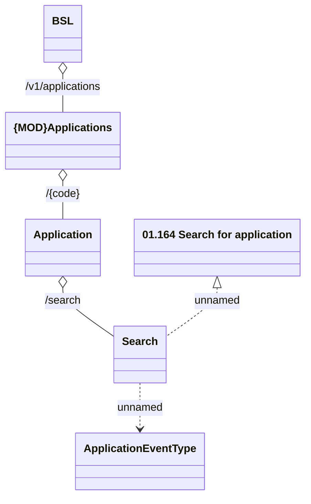

# Application search

- **Diagram Type**: Logical
- **Package**: HomerSelect/BSL/Analysis Model/_Interface/Provided Web Services/Application/Application Rest/Application
- **Diagram ID**: 163843
- **Elements**: 6
- **Connectors**: 5

