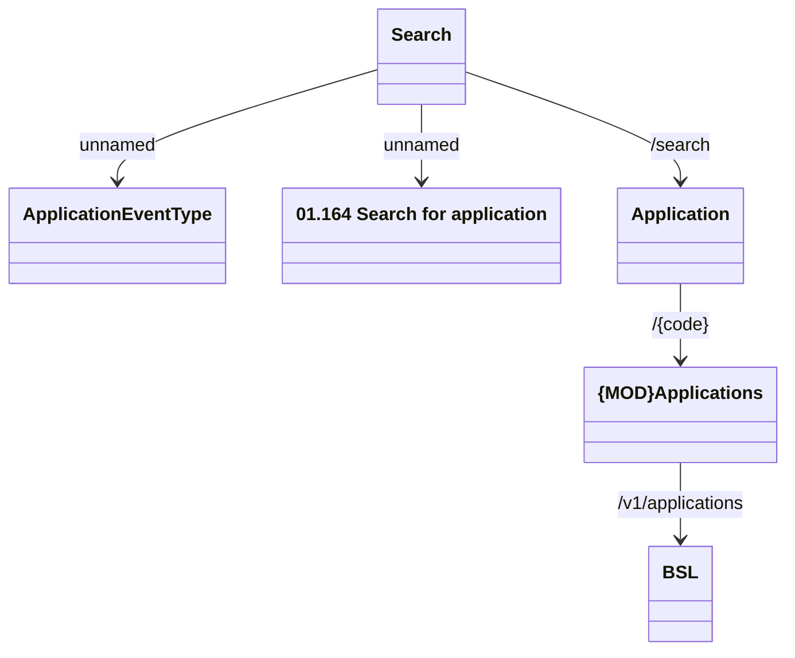

# Application search

```mermaid
classDiagram
    class MOD_Applications["{MOD}Applications"]
    class ApplicationEventType["ApplicationEventType"]
    class n_01_164_Search_for_application["01.164 Search for application"]
    class Search["Search"]
    class Application["Application"]
    class BSL["BSL"]
    MOD_Applications --> BSL : /v1/applications
    Search --> Application : /search
    Search --> n_01_164_Search_for_application : unnamed
    Search --> ApplicationEventType : unnamed
    Application --> MOD_Applications : /{code}
```
