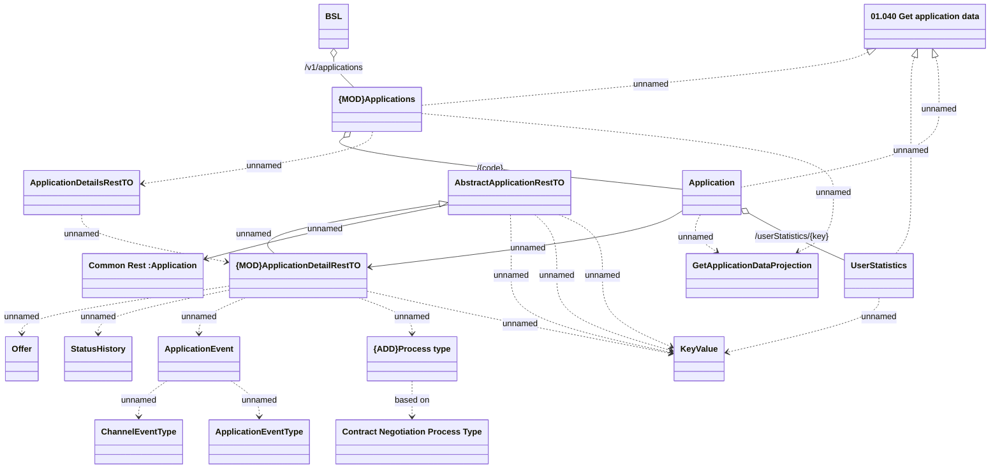

# Application

- **Diagram Type**: Logical
- **Package**: HomerSelect/BSL/Analysis Model/_Interface/Provided Web Services/Application/Application Rest/Application
- **Diagram ID**: 163842
- **Elements**: 18
- **Connectors**: 25

