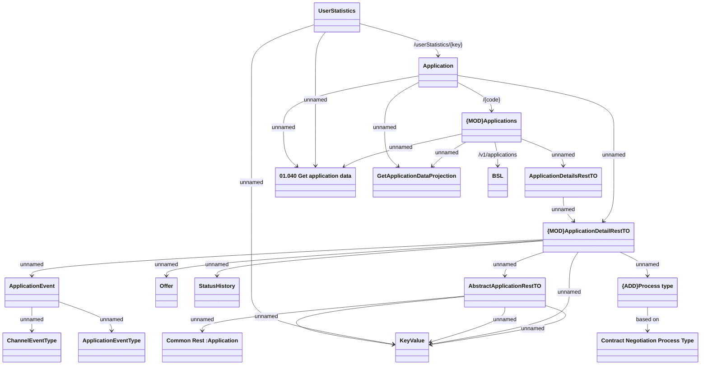

# Application

```mermaid
classDiagram
    class Contract_Negotiation_Process_Type["Contract Negotiation Process Type"]
    class ADD_Process_type["{ADD}Process type"]
    class ApplicationDetailsRestTO["ApplicationDetailsRestTO"]
    class MOD_Applications["{MOD}Applications"]
    class Offer["Offer"]
    class StatusHistory["StatusHistory"]
    class ChannelEventType["ChannelEventType"]
    class ApplicationEventType["ApplicationEventType"]
    class ApplicationEvent["ApplicationEvent"]
    class MOD_ApplicationDetailRestTO["{MOD}ApplicationDetailRestTO"]
    class AbstractApplicationRestTO["AbstractApplicationRestTO"]
    class Common_Rest_Application["Common Rest :Application"]
    class n_01_040_Get_application_data["01.040 Get application data"]
    class KeyValue["KeyValue"]
    class UserStatistics["UserStatistics"]
    class GetApplicationDataProjection["GetApplicationDataProjection"]
    class Application["Application"]
    class BSL["BSL"]
    MOD_Applications --> n_01_040_Get_application_data : unnamed
    Application --> MOD_Applications : /{code}
    MOD_ApplicationDetailRestTO --> Offer : unnamed
    MOD_ApplicationDetailRestTO --> StatusHistory : unnamed
    ApplicationEvent --> ChannelEventType : unnamed
    ApplicationEvent --> ApplicationEventType : unnamed
    MOD_ApplicationDetailRestTO --> ApplicationEvent : unnamed
    Application --> MOD_ApplicationDetailRestTO : unnamed
    ApplicationDetailsRestTO --> MOD_ApplicationDetailRestTO : unnamed
    MOD_ApplicationDetailRestTO --> AbstractApplicationRestTO : unnamed
    AbstractApplicationRestTO --> Common_Rest_Application : unnamed
    MOD_Applications --> ApplicationDetailsRestTO : unnamed
    UserStatistics --> n_01_040_Get_application_data : unnamed
    MOD_ApplicationDetailRestTO --> ADD_Process_type : unnamed
    ADD_Process_type --> Contract_Negotiation_Process_Type : based on
    AbstractApplicationRestTO --> KeyValue : unnamed
    MOD_ApplicationDetailRestTO --> KeyValue : unnamed
    AbstractApplicationRestTO --> KeyValue : unnamed
    UserStatistics --> KeyValue : unnamed
    AbstractApplicationRestTO --> KeyValue : unnamed
    MOD_Applications --> GetApplicationDataProjection : unnamed
    Application --> GetApplicationDataProjection : unnamed
    UserStatistics --> Application : /userStatistics/{key}
    MOD_Applications --> BSL : /v1/applications
    Application --> n_01_040_Get_application_data : unnamed
```
