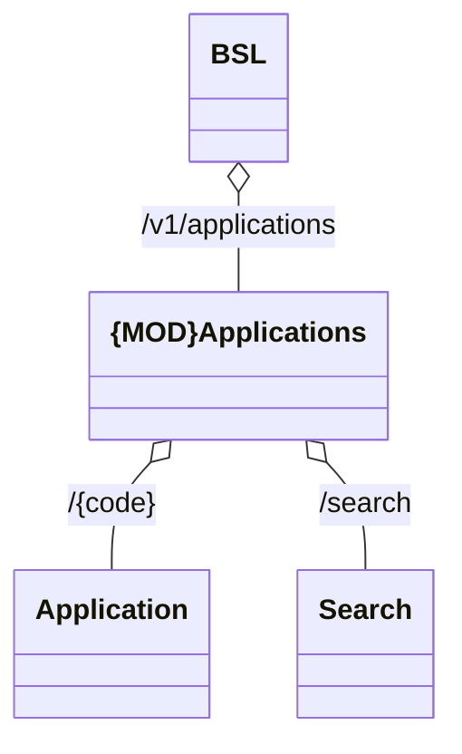

# Common Rest

- **Diagram Type**: Logical
- **Package**: HomerSelect/BSL/Analysis Model/_Interface/Provided Web Services/Application/Application Rest/Common Rest
- **Diagram ID**: 158546
- **Elements**: 4
- **Connectors**: 3

