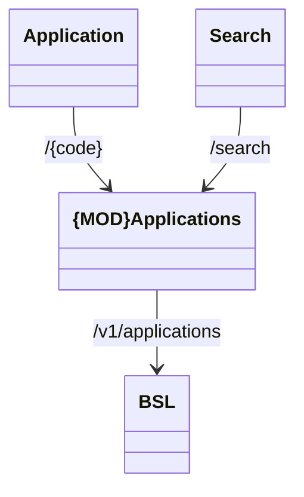

# Common Rest

```mermaid
classDiagram
    class Search["Search"]
    class MOD_Applications["{MOD}Applications"]
    class Application["Application"]
    class BSL["BSL"]
    Application --> MOD_Applications : /{code}
    MOD_Applications --> BSL : /v1/applications
    Search --> MOD_Applications : /search
```
