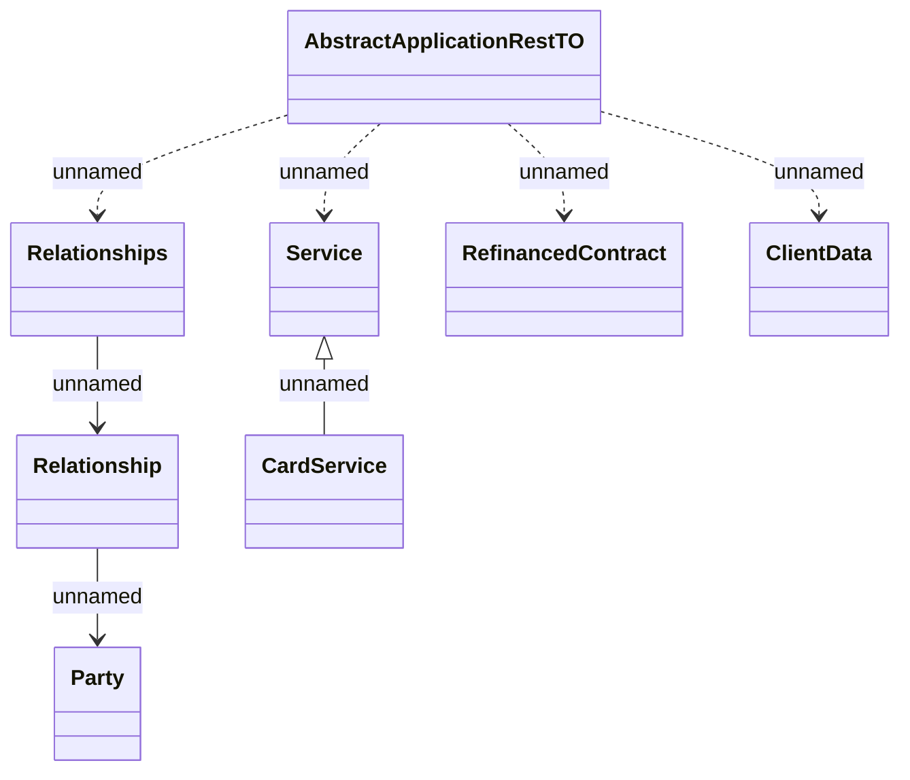

# Application

- **Diagram Type**: Logical
- **Package**: HomerSelect/BSL/Analysis Model/_Interface/Provided Web Services/Application/Application Rest/Common Rest/Representation
- **Diagram ID**: 158547
- **Elements**: 8
- **Connectors**: 7

